# Object Recognition

## Description

- The synthetic dataset provided contains labeled images of jacks, dollies, and bins in the BMW JSON format.
- The objective of the project is to preprocess the dataset, converting images and labels from JSON to the YOLO format for training object detection models.
- Train the object detection model using the YOLO algorithm, partitioning the dataset into train, test, and validation folders to assess performance.
- Compare different model configurations to determine the most effective one, visualizing training metrics using TensorBoard.
- Convert the trained model's weights (best.pt) to the ONNX format to optimize for deployment and assess detection speed.
- Evaluate the speed and accuracy of both the YOLO and ONNX models for object detection.
- Analyze the network architecture using Netron.
- Currently working in the process of developing an API for seamless integration of the object detection functionality and Dockerizing the application for easy 
  deployment and scalability.

For the source code, refer to _[SourceCode.ipynb](https://nbviewer.org/github/RC2303/ComputerVision/blob/main/Source_Code.ipynb)_.

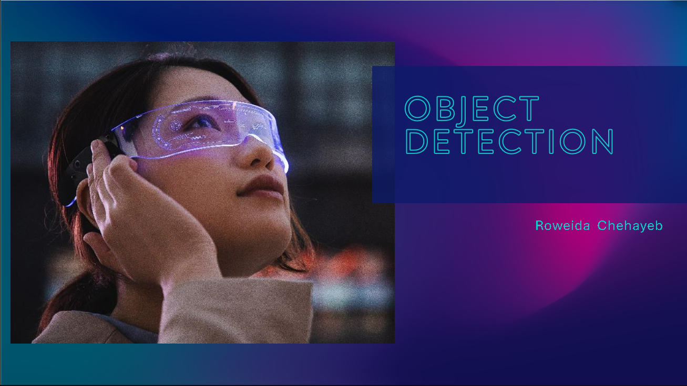
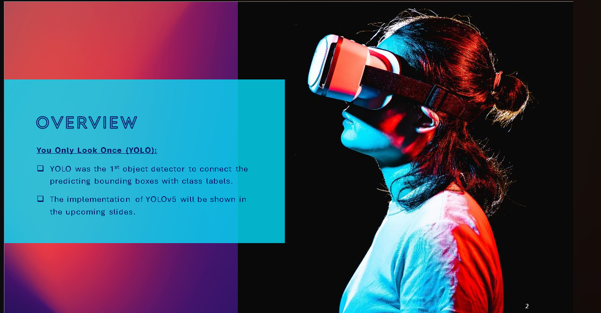
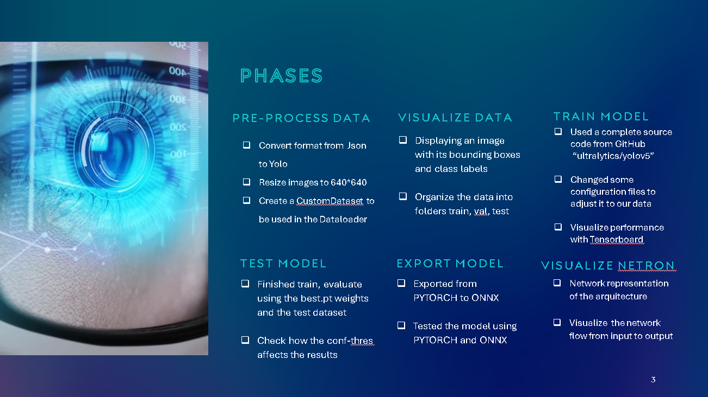
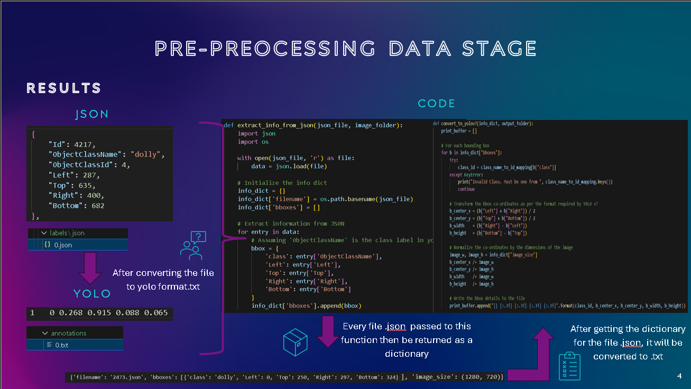
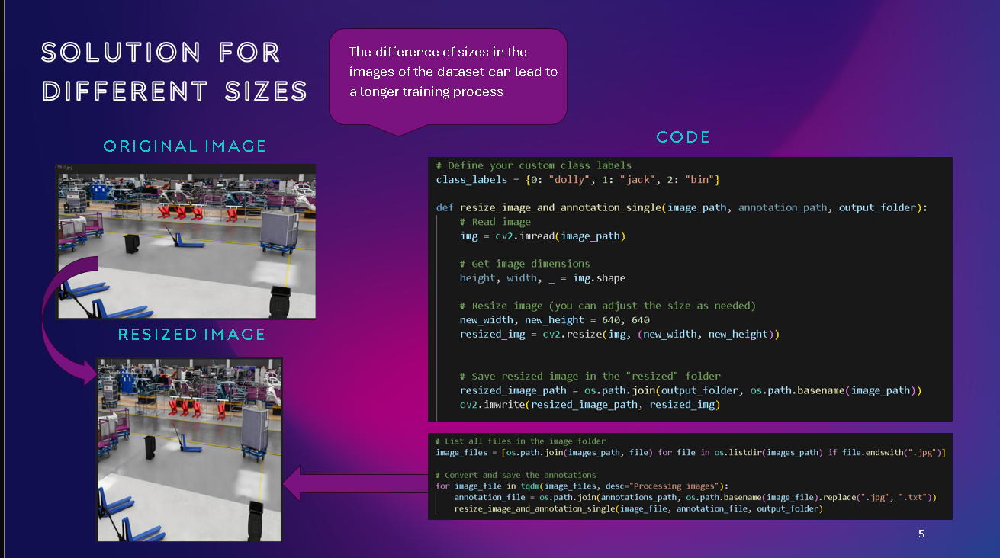
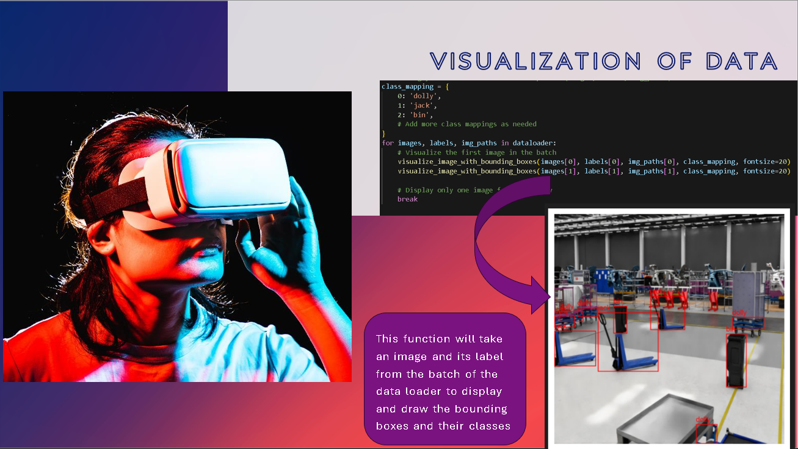
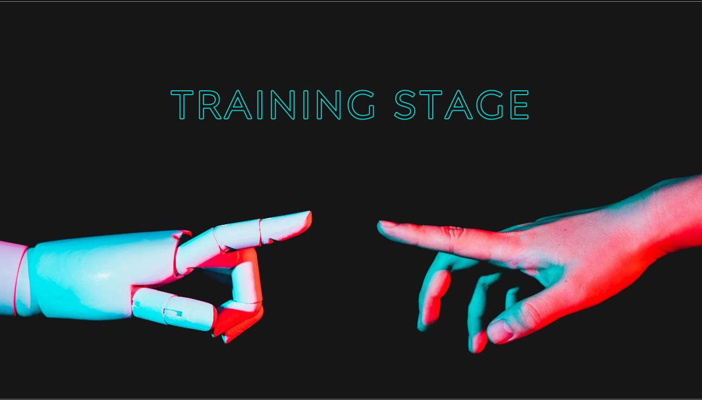
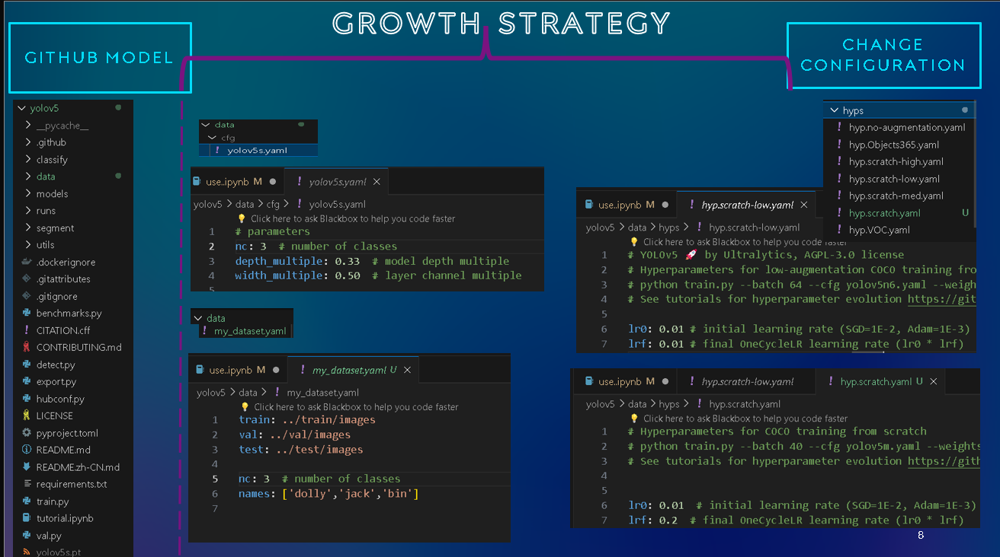
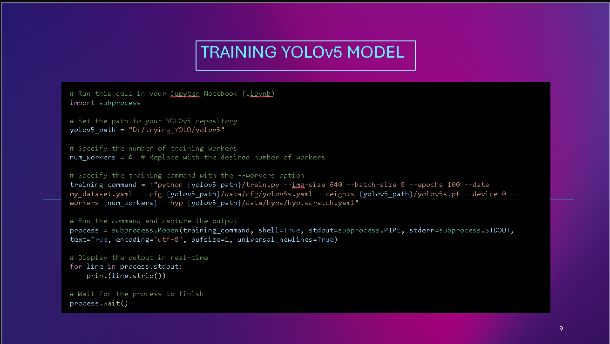
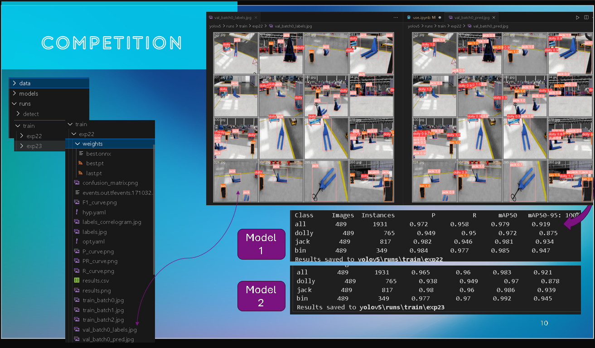
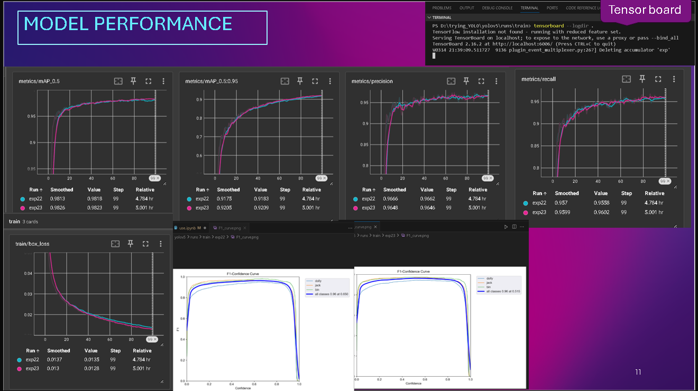
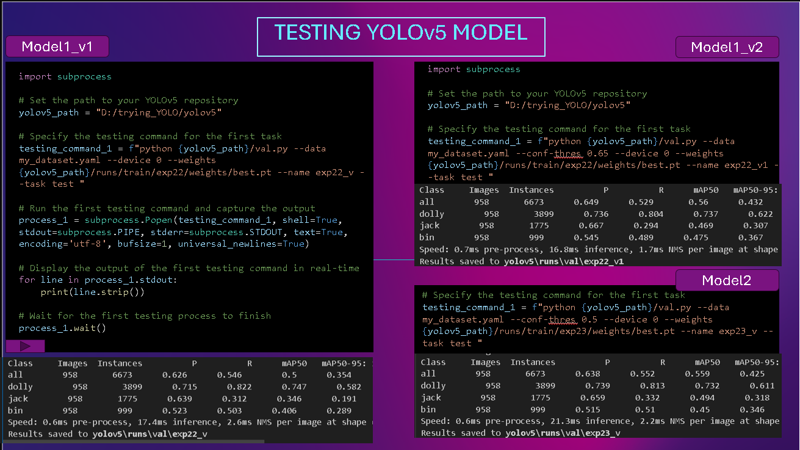
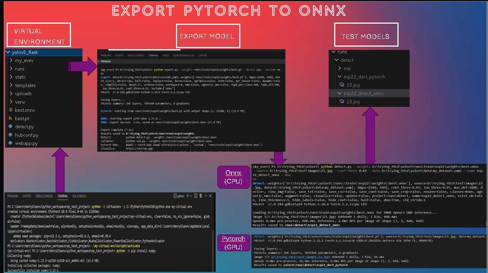
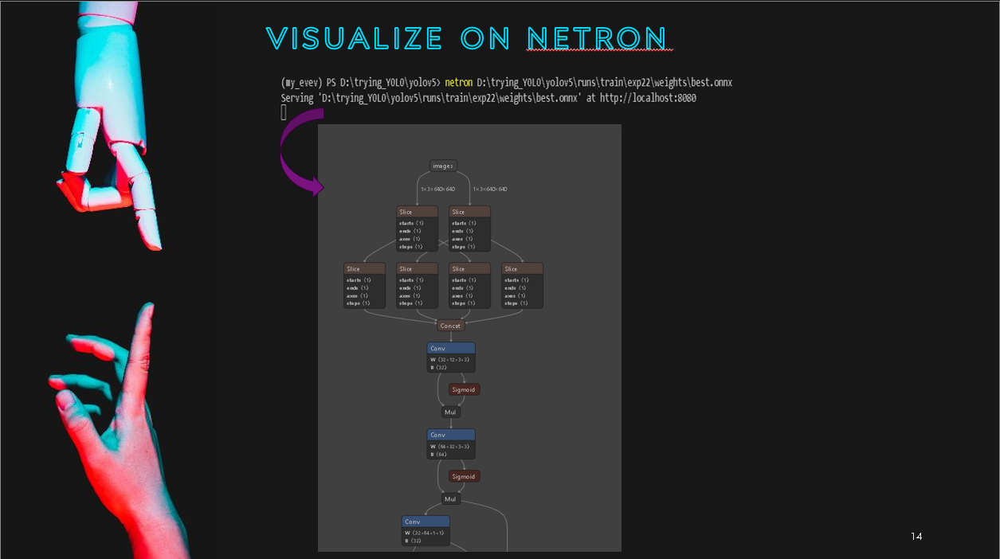

